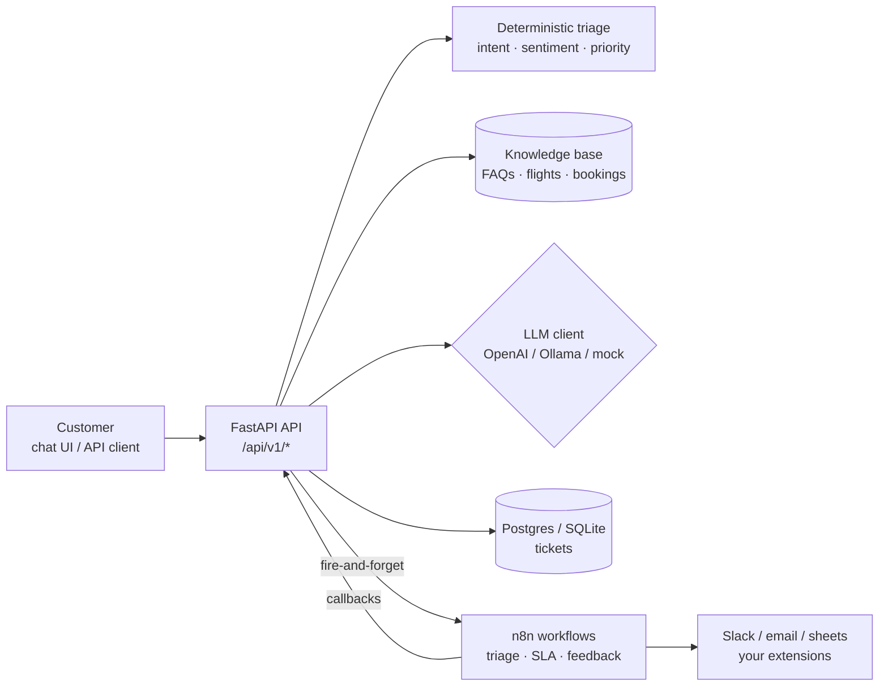

# Architecture

## System overview

## Request flows

**Chat (`POST /api/v1/chat`)** — the demo's hero path:

1. Triage the message (intent, sentiment, priority) — deterministic, no LLM needed.
2. Extract PNR (`ABC123`) and flight no (`AI202`) with regex; look up booking + flight.
3. Retrieve top-2 FAQs by keyword overlap (stand-in for vector search).
4. If the user wants a human (or the issue is urgent + negative) → create a priority ticket.
5. Draft the reply: LLM provider if configured, else grounded template fallback.
6. Return `reply + intent + confidence + sources + actions + ticket_id`.

**Ticket (`POST /api/v1/tickets`)** — same triage, persisted, then a fire-and-forget
event to the n8n `new-ticket` webhook. Automation failing never breaks ticket creation.

**n8n callbacks (`POST /api/v1/webhooks/n8n/ticket-event`)** — workflows act back on
tickets: `escalate | assign | resolve | close + note`.

## Key design decisions (say these in interviews)

| Decision | Why |
|----------|-----|
| Routing is deterministic, LLM only drafts | An LLM outage degrades reply quality, never correctness. Triage is unit-tested. |
| FAQ grounding before generation | Reduces hallucination; `sources[]` in every chat response proves it. |
| Provider chain `openai → ollama → mock` | Runs free/offline for recruiters; swap to real LLM with one env var. |
| n8n for orchestration, not business logic | Humans/tools change often — keep that in workflows, keep rules in code. |
| Webhooks both directions | API→n8n events and n8n→API callbacks = a real event-driven loop. |
| SQLite default, Postgres in compose | Zero-setup local run; production-shaped DB in Docker with one command. |

## Database schema

`Ticket(id, subject, message, customer_name, customer_email, pnr, flight_no,`
`intent, intent_confidence, priority, sentiment, status, assignee,`
`suggested_reply, created_at, updated_at)`

SLA breach = `now - created_at > sla_for_priority(priority)` while `open/pending`.
Thresholds come from env (`SLA_MINUTES_URGENT/HIGH/NORMAL`).

## Scaling notes (if an interviewer asks "what's next?")

- Replace `knowledge.search_faqs` with pgvector + embeddings for real RAG.
- Add auth (API keys → OAuth), rate limiting, and request IDs / structured logs.
- Move n8n notification to a task queue (Celery/ARQ) instead of in-request HTTP.
- Add evals: golden set of 50 support messages, assert intent accuracy in CI.
- Multi-channel: same `/chat` core behind WhatsApp/Telegram adapters in n8n.
